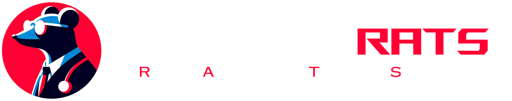
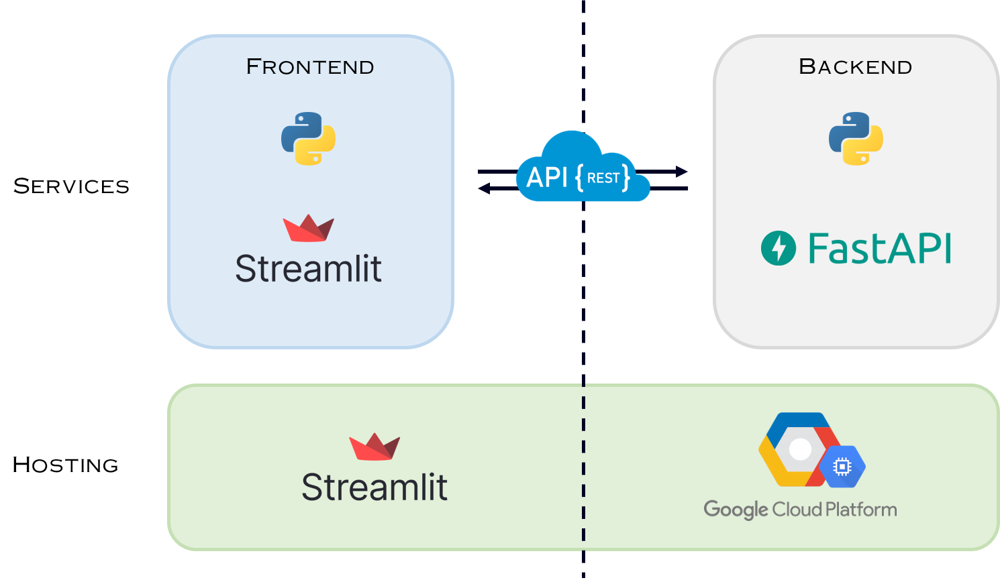

## Prologue
This is a repository for the Data Science Project course I have taken in my final year in Universiti Malaya. Data Science Project is equivalent to final year project for Data Science student in Universiti Malaya. I have indeed learn a lot from this project.

---

  

*Project RATS* (**R**apid **A**bdominal **T**rauma **S**creening) aims to provide rapid CT assessment for patients at risks of abdominal trauma using deep learning. This project is inspired from a Kaggle open competition organized by RSNA back in 2023. A multi-staged model architecture proposed by [Theo Viel](https://github.com/TheoViel/kaggle_rsna_abdominal_trauma/tree/cleaning) in the same year is chosen to be adapted into this project due to its relatively efficient model size, ease of understanding and modest computing power requirements.

Project RATS has further finetuned and improved the models in the whole image classification module of the system. The table below shows the result before and after finetuning.
| Metric             | Before | After      | Remarks           |
|--------------------|--------|------------|-------------------|
| AUROC              | 0.87   | **0.88***  | Higher the better |
| RSNA Trauma Metric | 0.232  | **0.211*** | Lower the better  |

The system is packaged into a web service using FAST API framework and hosted on GCP L4 GPU VM, serving as a backend inference server. A web dashboard is also developed with Streamlit and serves as the frontend. RESTful API are used to connect both the frontend and backend together. 

  

## Access
Web dashboard can be accessed via this [link](project-rats.streamlit.app) and the demonstration can be accessed via this [link](project-rats.streamlit.vercel.app/Model_Lab).

> [!NOTE]
> The backend server has been shut down as I am too broke to keep it running. The web dashboard is still accessible, but the demonstration is not working properly. Refer to the User Manual section in the appendix of this [report](https://github.com/Programmer420-1/project-rats/blob/main/Final%20Report%20%26%20User%20Manual.pdf) to see how the demonstration works.
